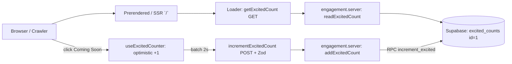

<p align="center">
  
</p>

<h1 align="center">⚛️ AtomIQ</h1>

<p align="center"><strong>Nuclear Science Is More Than You Think.</strong></p>
<p align="center">Making nuclear science clear, playful, and for everyone.</p>

<p align="center">
  
  
  
  
  
</p>

<p align="center">
  <a href="#-quick-start">Quick Start</a> •
  <a href="#-sections">Sections</a> •
  <a href="#-tech-stack">Tech Stack</a> •
  <a href="#-architecture">Architecture</a> •
  <a href="#-environment">Environment</a> •
  <a href="#-project-structure">Structure</a>
</p>

---

> **AtomIQ** turns nuclear science into interactive lessons, games, challenges, and trusted references — so anyone can understand the science beyond the myths.

This repo is the **marketing landing page** for AtomIQ: a fast, SEO-first, fully SSR single-route site with a live global “excited clicks” counter backed by Supabase.

---

## ✨ Highlights

| | |
|---|---|
| 🚀 **SEO-first SSR** | Full server render + prerendered `/` + ISR (`max-age=60, stale-while-revalidate=300`) |
| ⚡ **Instant counter** | Optimistic UI, 2s burst-batching, `localStorage` recovery, atomic Postgres RPC |
| 🛡️ **Never breaks SSR** | Graceful fallbacks if Supabase / loader fails; custom 404 + error boundaries |
| 🎨 **Playful design system** | SunghyunSans, brand orange `#ff9600`, full-viewport sections, pressable buttons |
| 👾 **Mascot + props** | Central mascot + 8 floating SVG props (alien, control panel, hologram, solar panel…) |
| 🧠 **Myth-busting quiz** | Myth vs. Fact challenge with explanations |
| 🤖 **Shrodi companion** | Friendly learning guide with source-backed sample Q&A modal |
| 📚 **48+ curated sources** | Every discovery traces back to real research |
| ♿ **Accessible** | Semantic landmarks, `aria-live` counter, labeled CTAs, keyboard-friendly FAQ/modal |

---

## 🖥️ Sections

| Section | What it does |
|---|---|
| **Hero** | Headline, live excited-clicks counter, Coming Soon CTA, mascot + floating flags |
| **Introduction** | Why nuclear science feels complex — and how AtomIQ simplifies it |
| **Explore** | Lessons, games, and discoveries preview + Shrodi modal |
| **Challenge** | “Radiation always causes cancer?” Myth / Fact quiz with explanations |
| **Journey** | Learning path: start simple, build step by step |
| **Team** | Michelle Reyes (Research), Kent Garcia (Dev, lead), Ezekiel Pinto (Research) |
| **FAQ** | What is AtomIQ, who it’s for, trust, Shrodi, availability |
| **Final CTA + Footer** | Second counter + CTA, copyright year from loader |
| **Navbar** | Sticky nav with anchor links + CTA |

---

## 🧰 Tech Stack

| Layer | Choice |
|---|---|
| Framework | [TanStack Start](https://tanstack.com/start) + [TanStack Router](https://tanstack.com/router) (file-based routing) |
| UI | React 19, custom CSS (no UI framework), `PressButton`, `SectionTransition` |
| Build | Vite 8 + `@vitejs/plugin-react` |
| Language | TypeScript (strict, `tsconfigPaths` aliases via `@/*`) |
| Data | TanStack Start server functions (`createServerFn`), Zod validation |
| Backend | Supabase Postgres (`excited_counts` table + RPC increment) |
| Fonts | SunghyunSans (Regular → ExtraBold, `woff2`, `font-display: swap`) |
| Prod server | `srvx` serving `dist/server/server.js` + `dist/client/` |

---

## 🏗️ Architecture



**File-separation convention:**

- `*.ts` — shared, client-safe (types, static content in `lib/landing.ts`, `lib/site.ts`)
- `*.functions.ts` — `createServerFn` wrappers only, lazy-import server code
- `*.server.ts` — server-only (Supabase, secrets, never imported on client)

---

## ⚡ Quick Start

```bash
npm install
npm run dev      # http://localhost:3000
```

```bash
npm run build    # SSR build + prerender `/`
npm run start    # prod: srvx --prod --dir . --entry ./dist/server/server.js --static ./dist/client
npm run preview  # preview production build
```

> Dev server runs on port `3000` (see `vite.config.ts`).

---

## 🔑 Environment

Create `.env` in the project root:

```bash
VITE_SUPABASE_URL=https://xyz.supabase.co
VITE_SUPABASE_KEY=eyJhbGciOi...
# optional
VITE_APP_URL=http://localhost:3000
```

| Var | Where | Purpose |
|---|---|---|
| `VITE_SUPABASE_URL` | server + client | Supabase project URL |
| `VITE_SUPABASE_KEY` | server + client | Supabase anon key |
| `SUPABASE_URL` / `SUPABASE_ANON_KEY` | server fallback | Node runtime fallback for SSR |
| `VITE_APP_URL` | shared | Canonical site URL (`lib/site.ts`) |

Missing keys only log a warning — the counter falls back to in-memory so SSR never crashes.

### Supabase setup (counter)

```sql
create table if not exists excited_counts (
  id int primary key,
  count int not null default 0
);

insert into excited_counts (id, count)
values (1, 0)
on conflict (id) do nothing;

create or replace function increment_excited(amount int)
returns int language plpgsql as $$
declare new_count int;
begin
  update excited_counts
  set count = count + greatest(1, least(amount, 1000))
  where id = 1
  returning count into new_count;
  return new_count;
end $$;
```

---

## 📁 Project Structure

```
atomiq-landing/
├── public/
│   ├── mascot.svg
│   ├── icon.png / icon-128.png
│   ├── images/            # hero props, mockups
│   │   ├── baby-alien.svg, control-panel.svg, hologram-monitor.svg
│   │   ├── solar-panel.svg, energy-cell.svg, energy-link.svg
│   │   ├── barricade-pillar.svg, space-base.svg
│   │   └── team/ michelle.webp, kent.webp, ezekiel.webp
│   └── fonts/SunghyunSans-Web/
├── src/
│   ├── routes/
│   │   ├── __root.tsx     # shell, SEO head, 404 + error boundary, Navbar
│   │   └── index.tsx      # `/` loader (count + year), ISR headers, sections
│   ├── components/
│   │   ├── layout/Navbar/ FinalCta/
│   │   ├── sections/Hero/ Introduction/ Explore/ Challenge/
│   │   │           Journey/ Shrodi/ Science/ Team/ Faq/
│   │   └── ui/PressButton/ SectionTransition/
│   ├── hooks/
│   │   ├── useExcitedCounter.ts  # optimistic burst counter
│   │   └── useReveal.ts          # scroll reveal
│   ├── lib/
│   │   ├── landing.ts            # FAQs, team, quiz, Shrodi samples (client-safe)
│   │   ├── site.ts               # site name, tagline, URL (client-safe)
│   │   ├── engagement.functions.ts  # GET count / POST increment
│   │   ├── engagement.schema.ts     # Zod validator
│   │   ├── engagement.server.ts     # Supabase + memory fallback
│   │   └── env.server.ts            # server env validation
│   ├── styles/
│   │   ├── globals.css variables.css typography.css
│   ├── utils/supabase.ts
│   ├── router.tsx
│   └── routeTree.gen.ts
├── vite.config.ts         # TanStack Start + prerender config
├── tsconfig.json
└── package.json
```

---

## 🎯 Counter Details

`useExcitedCounter(initialCount)`:

1. Renders SSR count immediately (no hydration mismatch).
2. Each click increments display instantly (`global + local`).
3. Batches bursts into **one POST per 2s** (`delta` clamped 1–1000, Zod-validated).
4. Persists pending clicks to `localStorage` (`atomiq:excited-pending`) across refresh/close.
5. Refetches fresh global count on mount; server stays source of truth.

---

## 🔍 SEO & Performance

- Full SSR by default; `/` prerendered at build (`crawlLinks`, concurrency 14).
- Route `headers()`: `public, max-age=60, s-maxage=60, stale-while-revalidate=300`.
- `staleTime: 30s`, `gcTime: 5min` on the index route.
- Semantic `<main>`, per-route `<meta>` + OG tags, `icon.png` favicon, `icon-128.png` preload.
- Lazy-loaded decorative images (`width`/`height` set to avoid CLS), `min-height: 100svh` sections.

---

## 🧪 Useful Commands

```bash
npm run dev    # develop
npm run build  # type-safe + SSR + prerender check
npm run start  # serve prod locally
```

No test runner is configured yet. Typecheck via `tsc --noEmit` if needed.

---

## 👥 Team

| | Name | Role |
|---|---|---|
| 🧬 | **Michelle Reyes** | Researcher |
| 💻 | **Kent Garcia** | Developer (lead) |
| 🔬 | **Ezekiel Pinto** | Researcher |

---

## 📄 License

Private project — all rights reserved. Contact the AtomIQ team for reuse permission.

---

<p align="center">Built with ⚛️ + ⚡ + 💛 by the AtomIQ team.<br/>Nuclear science is more than you think.</p>

